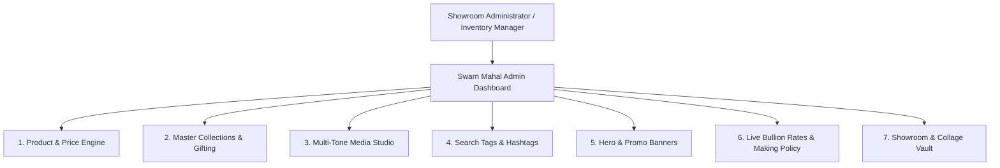
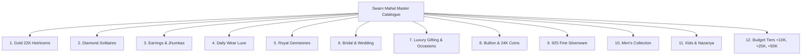

# 👑 Swarn Mahal — Comprehensive Admin Portal Architecture & Specification Guide (`ADMIN.md`)

> **Sawarn Luxury Jewels & Dynamic Bullion E-Commerce Platform**  
> *Complete schema, workflows, and module specifications for managing Products, Dynamic Pricing Formulas, Multi-Angle Imagery, Complete Collections & Sub-Collections (Gifting, Bridal, Daily Wear, Bullion, Men's, Silverware), Hero Banners, Search Tags, and Live Bullion Rates.*

---

## 📑 Table of Contents
1. [System Overview & Admin Roles](#1-system-overview--admin-roles)
2. [Module 1: Product Management & Dynamic Pricing](#2-module-1-product-management--dynamic-pricing)
3. [Module 2: Complete Collections & Hierarchy Taxonomy](#3-module-2-complete-collections--hierarchy-taxonomy)
   - [2.1 The Master Collections Taxonomy](#31-the-master-collections-taxonomy)
   - [2.2 Gifting & Occasion Collections Architecture](#32-gifting--occasion-collections-architecture)
   - [2.3 Bridal & Wedding Couture Suite](#33-bridal--wedding-couture-suite)
   - [2.4 Daily Wear & Minimalist Luxe Suite](#34-daily-wear--minimalist-luxe-suite)
   - [2.5 Bullion, Gold Coins & Investment Assets](#35-bullion-gold-coins--investment-assets)
   - [2.6 925 Sterling Silverware & Puja Articles](#36-925-sterling-silverware--puja-articles)
   - [2.7 Men's Luxury Jewellery Collection](#37-mens-luxury-jewellery-collection)
   - [2.8 Kids & Milestone Gifting](#38-kids--milestone-gifting)
   - [2.9 Budget-Tiered Collections (Under ₹10K, ₹25K, ₹50K)](#39-budget-tiered-collections-under-10k-25k-50k)
4. [Module 3: Media & Multi-Angle Image Asset Studio](#4-module-3-media--multi-angle-image-asset-studio)
5. [Module 4: Search Tags, Hashtags & NLP Search Engine](#5-module-4-search-tags-hashtags--nlp-search-engine)
6. [Module 5: Hero Slider, Promotional Banners & Spotlights](#6-module-5-hero-slider-promotional-banners--spotlights)
7. [Module 6: Live Bullion Rates & Making Charge Policy Engine](#7-module-6-live-bullion-rates--making-charge-policy-engine)
8. [Module 7: 21st.dev Collage & Showroom Vault Studio](#8-module-7-21stdev-collage--showroom-vault-studio)
9. [JSON Schema Blueprint (`ProductSchema`)](#9-json-schema-blueprint-productschema)
10. [Recommended Next.js Admin Route Architecture (`/admin`)](#10-recommended-nextjs-admin-route-architecture-admin)

---

## 1. System Overview & Admin Roles

The Swarn Mahal Admin Portal empowers showroom managers, karigars, and inventory operators to control the entire e-commerce catalogue in real-time without touching raw code.



---

## 2. Module 1: Product Management & Dynamic Pricing

Har product ka calculation 100% mathematical formula par based hai jo live bullion rate aur dynamic making charges ke sath calculate hota hai.

### 2.1 Product Core Attributes (Fields)

| Field Name | Data Type | Required | Description & Example |
| :--- | :--- | :---: | :--- |
| `id` | String | **Yes** | Unique SKU code (e.g. `SM-101`, `SM-RNG-2026`) |
| `title` | String | **Yes** | Display title (e.g. `Rubans Modern Solitaire Ring`) |
| `slug` | String | **Yes** | URL-safe slug (e.g. `rubans-modern-solitaire-ring`) |
| `description` | Text | **Yes** | Detailed luxury description for PDP |
| `dimensions` | String | No | Physical specs (e.g. `Band Width: 2.2mm \| Crown Height: 5.5mm`) |
| `huid` | String | **Yes** | BIS 6-digit laser alphanumeric HUID (e.g. `SM916A8201`) |
| `certificate` | String | **Yes** | Official assay lab code (e.g. `IGI-LG5829104`, `BIS 916`) |

---

### 2.2 Precious Metal & Formula Weights

```
┌────────────────────────────────────────────────────────┐
│               METAL COST FORMULA                       │
│  Metal Cost = Net Gold Weight (g) × Live Karat Rate/g  │
└────────────────────────────────────────────────────────┘
```

- **`netGoldWeightGrams`** (Number, e.g. `4.85`): Pure gold weight in grams (used for live bullion calculations).
- **`grossWeightGrams`** (Number, e.g. `5.10`): Total weight including stones/beads/enamel.
- **`defaultKarat`** (Enum: `24K` | `22K` | `18K` | `14K`): Default purity shown on page load.
- **`supportedKarats`** (Array, e.g. `["14K", "18K", "22K"]`): Karats available for customer switching.
- **`defaultColor`** (Enum: `yellow` | `rose` | `white`): Default metal tone.
- **`supportedColors`** (Array, e.g. `["yellow", "rose", "white"]`): Metal tones available for customer.

---

### 2.3 Making Charges & Festive Discounts

Admin can configure making charges in two modes:

1. **Percentage of Gold Value (`percent`)**:
   - `makingChargePercent` (e.g. `14%`): Standard karigar fee calculated as `Metal Cost × (Percent / 100)`.
2. **Per Gram Fixed Surcharge (`per_gram`)**:
   - `makingChargePerGram` (e.g. `₹650/g`): Calculated as `Gross Weight (g) × ₹/g`.
3. **Discount Incentive**:
   - `discountPercent` (e.g. `15%`): Applied on making charges (e.g. *"Flat 15% OFF on Making"*).

---

### 2.4 Diamond & Solitaire Specifications (`diamondSpecs`)

- `stoneCount` (Number, e.g. `1` or `28`): Total number of stones set in the piece.
- `totalCaratWeight` (Number, e.g. `0.35` ct): Aggregate diamond carat weight.
- `clarity` (Enum: `VVS-EF`, `VS-GH`, `SI-IJ`, `FL-IF`): International clarity grade.
- `cut` (Enum: `Round Brilliant`, `Princess`, `Emerald Cut`, `Baguette`, `Oval`): Faceting cut.
- `pricePerCarat` (Number, e.g. `₹68,000` / carat): Valuation rate for diamond cost computation.

```
Diamond Cost = Total Carat Weight (ct) × Price Per Carat (₹/ct)
```

---

### 2.5 Precious Natural Gemstones (`gemstoneSpecs`)

- `stoneType` (String, e.g. `Natural Zambian Emerald`, `Burmese Ruby`, `Ceylon Blue Sapphire`, `South Sea Pearl`).
- `weightCarat` (Number, e.g. `1.25` ct): Total gemstone weight.
- `pricePerCarat` (Number, e.g. `₹22,000` / carat).

---

## 3. Module 2: Complete Collections & Hierarchy Taxonomy

### 3.1 The Master Collections Taxonomy

The Swarn Mahal catalogue supports deep multi-level taxonomy mapping:



---

### 3.2 Gifting & Occasion Collections Architecture (`gifting`)

Admin portal enables specific occasion grouping, packaging customizer, and complimentary greeting card setup.

| Sub-Collection | Target Audience / Occasion | Price Range | Example Products |
| :--- | :--- | :--- | :--- |
| **Tamper-Proof 24K Gold Coins** | Akshaya Tritiya, Dhanteras, Diwali | ₹7,500 - ₹75,000+ | 1g, 2g, 5g, 10g 24K Laxmi Ganesh Blister Assayed Coins |
| **Romantic & Solitaire Gifts** | Valentine's, Anniversaries, Proposals | ₹18,000 - ₹1,50,000 | 18K Solitaire Rings, Heart Diamond Pendants, Infinity Bands |
| **Birthday & Personal Milestones** | Birthdays, Graduations, Promotions | ₹12,000 - ₹60,000 | Initial Letter Pendants, Sleek Gold Chains, Sui-Dhaga Drops |
| **Festive & Diwali Gifting** | Corporate Gifts, Family Blessings | ₹2,500 - ₹1,00,000 | 925 Silver Lakshmi-Ganesh Coins, Silver Diyas, Gold Pendants |
| **Newborn & Baby Blessings** | Naamkaran, Mundan, Baby Shower | ₹4,500 - ₹25,000 | 22K Gold Nazariya Bracelets, Silver Rattle, Baby Kadas |

#### Gifting Configuration Properties in Admin:
```json
{
  "giftPackagingOptions": [
    { "type": "signature_velvet_box", "label": "Royal Swarn Mahal Velvet Box", "cost": 0 },
    { "type": "luxury_wooden_trousseau", "label": "Handcrafted Rosewood Chest", "cost": 750 }
  ],
  "complimentaryGiftCard": true,
  "tamperProofBlisterPackaging": true,
  "readyToShipIn24Hours": true
}
```

---

### 3.3 Bridal & Wedding Couture Suite (`wedding`)

Designed for grand North Chhattisgarh weddings, muhurat purchases, and family trousseau planning.

- **Bridal Rani Haars** (25g – 80g+): Long multi-layered 22K gold necklaces with nakshi karigari.
- **Kundan & Jadau Polki Chokers**: Intricate handcrafted neckpieces with natural gemstone beads.
- **Sacred Mangalsutra Suites**: Traditional long 22K black-bead haars and contemporary diamond mangalsutras.
- **Handcrafted Kadas & Bangles (Pairs)**: Solid 22K screw-hinge gold kadas, antique finish kadas.
- **Bridal Ensembles**: Complete matching Matha Patti, Maang Tikka, Nath, Haathphool, and Kamarbandh.

---

### 3.4 Daily Wear & Minimalist Luxe Suite (`daily-wear`)

Engineered for modern lifestyle, working professionals, and lightweight comfort:

- **Weight Benchmark**: Strictly engineered **Under 10 Grams**.
- **Metal Benchmark**: 14K & 18K Gold for superior durability, scratch resistance, and daily active wear.
- **Categories**: Sleek stackable rings, geometric diamond pendants, lightweight huggie hoop earrings, office-wear mangalsutras.

---

### 3.5 Bullion, Gold Coins & Investment Assets (`bullion`)

- **24K Pure Gold Coins (99.9% 999 Purity)**:
  - Weight variants: `1 Gram`, `2 Grams`, `5 Grams`, `10 Grams`, `20 Grams`, `50 Grams`.
  - Motifs: Lord Ganesha, Goddess Lakshmi, Om, Swastik, Rose Motif.
  - Packaging: NABL / BIS Assayed tamper-evident sealed blister cards.
- **Making Charges**: Minimal flat maker charge (3% to 5%).

---

### 3.6 925 Sterling Silverware & Puja Articles (`silver`)

- **Fine 925 Silver Coins & Bars**: 10g, 20g, 50g, 100g, 250g, 500g, 1kg Fine 999 Silver Bars.
- **Puja & Religious Utensils**: 925 Sterling Silver Puja Thalis, Diyas, Kalash, Agarbatti Stands, Chandan Cups.
- **Silver Jewellery**: Handcrafted Payals, Chandi ki Bichhiya, Silver Bracelets, Kada for infants.

---

### 3.7 Men's Luxury Jewellery Collection (`mens`)

- **Solid 22K Men's Gold Chains**: Cuban link, Box link, Rope chain, Rudraksha mala with 22K gold caps.
- **Men's Heavy Kadas**: Solid 22K Sikh Kada, Lion Head motif kada, Bahubali engraved kada.
- **Men's Signet & Diamond Rings**: 18K/22K Solitaire rings, Tiger eye gemstone rings, Navratna rings.
- **Royal Accessories**: 22K Gold Kurta Buttons, Diamond Cufflinks, Gold Brooches for Sherwanis.

---

### 3.8 Kids & Milestone Gifting (`kids`)

- **Nazariya & Protection**: 22K Gold & Black Bead Nazariya for infants with evil-eye charms.
- **Baby Bangles & Kadas**: Smooth-edge expandable gold & silver bangles.
- **Cartoon & Animal Studs**: Lightweight enamel & diamond earrings for young girls.

---

### 3.9 Budget-Tiered Collections (Under ₹10K, ₹25K, ₹50K)

Allows customers to filter jewellery dynamically based on live gold price constraints:

1. **Under ₹10,000 (`under-10k`)**: 1g 24K Gold Coins, Silverware, 14K Nose Pins, Minimalist Gold Rings.
2. **Under ₹25,000 (`under-25k`)**: 18K Diamond Pendants, 2g-3g 22K Gold Rings, Solitaire Studs.
3. **Under ₹50,000 (`under-50k`)**: 5g 22K Gold Chains, Pavé Diamond Eternity Bands, Gemstone Cocktail Rings.

---

## 4. Module 3: Media & Multi-Angle Image Asset Studio

```
┌────────────────────────────────────────────────────────┐
│                 PRODUCT IMAGE MATRIX                   │
├───────────────────┬────────────────────────────────────┤
│ yellow            │ Main 22K/18K Yellow Gold photo     │
│ rose              │ Matching Rose Gold variant photo   │
│ white             │ Matching White Gold variant photo  │
│ hover             │ 45° angle/lifestyle hover preview  │
│ gallery[]         │ High-res 1200px zoom array (1..6)  │
└───────────────────┴────────────────────────────────────┘
```

---

## 5. Module 4: Search Tags, Hashtags & NLP Search Engine

### 5.1 Tag Classification

```json
{
  "searchKeywords": [
    "solitaire ring",
    "diamond ring for women",
    "engagement ring",
    "18k white gold ring",
    "rubans solitaire",
    "gifting under 50k",
    "diwali gold coin",
    "bridal rani haar"
  ],
  "hashtags": [
    "#SolitaireRing",
    "#DiamondJewellery",
    "#SwarnMahal",
    "#AmbikapurWeddings",
    "#GoldCoins24K",
    "#GiftingJewellery"
  ],
  "occasions": ["Engagement", "Anniversary", "Cocktail Gala", "Diwali Gifting", "Wedding"],
  "gender": "Women",
  "styleTheme": "Modern Minimalist"
}
```

---

## 6. Module 5: Hero Slider, Promotional Banners & Spotlights

Admin can update the homepage curved banner slides, seasonal festive promotions, and spotlight cards without code changes.

### 6.1 Hero Slider Slide Schema

```json
{
  "id": "hero-slide-1",
  "order": 1,
  "isActive": true,
  "tagBadge": "BRIDAL COUTURE 2026",
  "titleMain": "ROYAL HEIRLOOMS &",
  "titleItalic": "BRIDAL KUNDAN",
  "description": "Intricately woven 22K gold with uncut diamonds, emeralds & pearls crafted for brides.",
  "buttonText": "EXPLORE HERITAGE",
  "buttonLink": "/collections/wedding",
  "backgroundImage": "https://images.unsplash.com/photo-1599643478518-a784e5dc4c8f?auto=format&fit=crop&w=1600&q=85",
  "overlayGradient": "linear-gradient(90deg, rgba(16, 12, 10, 0.94) 0%, rgba(16, 12, 10, 0.78) 45%, rgba(16, 12, 10, 0.25) 78%, transparent 100%)"
}
```

---

## 7. Module 6: Live Bullion Rates & Making Charge Policy Engine

Admin can adjust benchmark bullion rates or connect an external API provider (e.g. GoldAPI / IBJA).

```
┌────────────────────────────────────────────────────────┐
│            AUTOMATIC KARAT BENCHMARK DERIVATION        │
├───────────────┬──────────────┬─────────────────────────┤
│ Purity        │ Ratio        │ Live Formula / Gram     │
├───────────────┼──────────────┼─────────────────────────┤
│ 24K Pure Gold │ 100.00%      │ Base Rate (e.g. ₹7,380) │
│ 22K Hallmark  │ 22/24 (91.6%)│ Base × 0.9167 (₹6,765)  │
│ 18K Diamond   │ 18/24 (75.0%)│ Base × 0.7500 (₹5,535)  │
│ 14K Luxe Gold │ 14/24 (58.3%)│ Base × 0.5833 (₹4,305)  │
│ 925 Silver    │ Fine Silver  │ Base Silver / g (₹89.5) │
└───────────────┴──────────────┴─────────────────────────┘
```

---

## 8. Module 7: 21st.dev Collage & Showroom Vault Studio

Admin can upload real showroom moments, bridal consultation photos, and electronic scale verification images into the asymmetric 12-column masonry bento grid.

### 8.1 Collage Item Schema
```json
{
  "id": "gal-1",
  "title": "22K Royal Bridal Rani Haar Suite",
  "category": "bridal",
  "badge": "22K BIS 916",
  "spanClass": "span-tall",
  "image": "/asset/WhatsApp Image 2026-08-13 at 12.17.43 PM (1).jpeg",
  "desc": "Authentic handcrafted bridal necklaces and rani haar suites crafted by master karigars for North Chhattisgarh weddings.",
  "specs": "28.5g Net Gold • 916 Hallmark HUID"
}
```

---

## 9. JSON Schema Blueprint (`ProductSchema`)

Complete TypeScript interface representing an individual item in the Swarn Mahal catalog:

```typescript
export interface AdminProductPayload {
  // 1. Identity & Routing
  id: string; // e.g. "SM-101"
  title: string; // e.g. "Rubans Modern Solitaire Ring"
  slug: string; // e.g. "rubans-modern-solitaire-ring"
  collection: string; // e.g. "Solitaire Collection"
  
  // 2. Taxonomy & Categorization
  category: "rings" | "necklaces" | "earrings" | "bangles" | "pendants" | "bullion" | "silverware" | "mens" | "kids";
  subCategory?: string; // e.g. "Solitaire Rings", "Jhumkas", "Rani Haar", "Laxmi Ganesh Coins", "Nazariya"
  navCategories: (
    | "all"
    | "gold"
    | "diamond"
    | "earrings"
    | "daily-wear"
    | "gemstone"
    | "wedding"
    | "gifting"
    | "bullion"
    | "silver"
    | "mens"
    | "kids"
    | "under-10k"
    | "under-25k"
    | "under-50k"
  )[];
  
  // 3. Status & Badging
  isFeatured: boolean;
  isNew: boolean;
  rating: number; // e.g. 4.9
  reviews: number; // e.g. 24
  
  // 4. Precious Metal & Weights
  netGoldWeightGrams: number; // e.g. 4.85
  grossWeightGrams: number; // e.g. 5.10
  defaultKarat: "24K" | "22K" | "18K" | "14K";
  supportedKarats: ("24K" | "22K" | "18K" | "14K")[];
  defaultColor: "yellow" | "rose" | "white";
  supportedColors: ("yellow" | "rose" | "white")[];
  
  // 5. Making Charges & Discount
  makingChargeType?: "percent" | "per_gram"; // default: "percent"
  makingChargePercent?: number; // e.g. 14%
  makingChargePerGram?: number; // e.g. ₹650/g
  discountPercent?: number; // e.g. 15%
  
  // 6. Diamonds & Gemstones (Optional)
  diamondSpecs?: {
    stoneCount: number; // e.g. 1
    totalCaratWeight: number; // e.g. 0.35
    clarity: string; // e.g. "VVS-EF"
    cut: string; // e.g. "Round Brilliant"
    pricePerCarat: number; // e.g. 68000
  };
  gemstoneSpecs?: {
    stoneType: string; // e.g. "Natural Zambian Emerald"
    weightCarat: number; // e.g. 1.25
    pricePerCarat: number; // e.g. 22000
  };
  
  // 7. Multi-Angle & Tone Imagery
  images: {
    yellow: string; // URL / Asset path
    rose?: string;
    white?: string;
    hover: string;
    gallery: string[];
  };
  
  // 8. Compliance & Legal
  huid: string; // e.g. "SM916A8201"
  certificate: string; // e.g. "IGI-LG5829104"
  description: string;
  dimensions?: string;
  
  // 9. SEO & Search Tags
  searchKeywords: string[];
  hashtags: string[];
  occasions?: string[];
  gender?: "Women" | "Men" | "Unisex" | "Kids";
}
```

---

## 10. Recommended Next.js Admin Route Architecture (`/admin`)

To implement an interactive web portal for this schema in Next.js:

```
src/app/admin/
├── layout.tsx               # Admin Sidebar, Header, Live Bullion Monitor
├── page.tsx                 # Analytics Dashboard (Total Products, Active Orders, Revenue)
├── products/
│   ├── page.tsx             # Product Inventory Table with Live Price & Search
│   ├── new/page.tsx         # Add New Product (Full Form with Real-time Preview)
│   └── [id]/edit/page.tsx   # Edit Product, Weights, Stones, and Multi-Tone Images
├── collections/
│   ├── page.tsx             # Master Collections & Sub-Collections Manager
│   ├── gifting/page.tsx     # Gifting, Occasions & Gift Boxes Studio
│   └── bridal/page.tsx      # Wedding Trousseau Suites & Sets Manager
├── banners/
│   └── page.tsx             # Hero Slider & Bento Promo Banner Editor
├── rates/
│   └── page.tsx             # Live Bullion Benchmark Override & Making Charge Rules
├── gallery/
│   └── page.tsx             # 21st.dev Collage & Showroom Photos Uploader
└── api/
    ├── products/route.ts    # GET / POST Products CRUD API
    └── rates/route.ts       # Bullion Rate Webhook & Update API
```

---

*Document prepared for Swarn Mahal Jewellers, Ambikapur. All rights reserved.*
