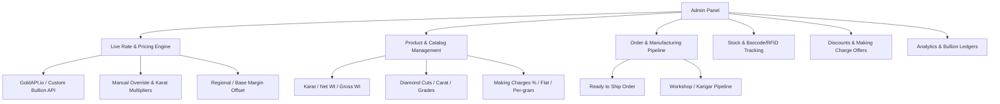
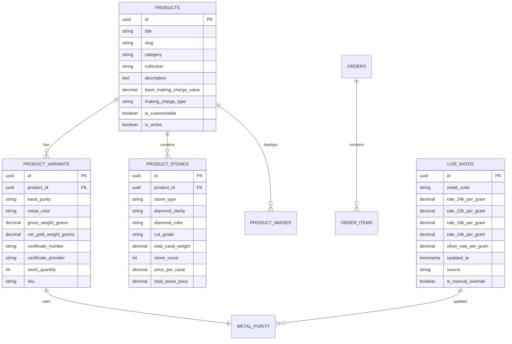

# 💎 Luxury Jewellery E-Commerce Platform Specification
> **Inspired by Brands like Tanishq, BlueStone, CaratLane & Kalyan Jewellers**

---

## 📌 1. Project Overview & Vision
This document outlines the complete architectural, functional, and operational requirements for a modern, high-end jewellery e-commerce platform. 

The platform requires a **Dynamic Formula-Driven Pricing Engine** that connects with Live Gold & Precious Metal APIs (e.g. `GoldAPI.io`), automatically recalculating product prices in real-time based on karat purity, net gold weight, diamond/gemstone attributes, making charges, discounts, and applicable taxes (GST).

---

## ⚡ 2. Core Feature: Dynamic Pricing & Gold Rate Calculation Engine

Jewellery pricing differs from standard e-commerce because gold/silver prices fluctuate daily or minute-by-minute. 

### 📐 2.1 The Standard Jewellery Pricing Formula
For any product (e.g., Gold Earrings, Diamond Ring, Solitaire Pendant):

$$\mathbf{Total\ Price} = \mathbf{Metal\ Cost} + \mathbf{Diamond / Gemstone\ Cost} + \mathbf{Making\ Charges} - \mathbf{Discounts} + \mathbf{Applicable\ Taxes\ (GST)}$$

Where:
1. **Metal Cost**:
   $$\text{Metal Cost} = \text{Net Metal Weight (grams)} \times \text{Live Rate per gram for selected Karat (24K / 22K / 18K / 14K / 9K / Silver / Platinum)}$$
2. **Karat Purity Conversion Factors (from 24K 99.9% base)**:
   - **24 Karat (999 Purity)**: $100\%$ of base rate
   - **22 Karat (916 Purity)**: $(22 / 24) \times \text{Base 24K Rate} \approx 91.67\%$
   - **18 Karat (750 Purity)**: $(18 / 24) \times \text{Base 24K Rate} \approx 75.00\%$
   - **14 Karat (585 Purity)**: $(14 / 24) \times \text{Base 24K Rate} \approx 58.33\%$
   - **9 Karat (375 Purity)**: $(9 / 24) \times \text{Base 24K Rate} \approx 37.50\%$
3. **Making Charges Options**:
   - **Percentage-based**: e.g., $12\%$ to $25\%$ of total metal cost.
   - **Per-Gram fixed rate**: e.g., ₹$550$ / gram $\times$ Gross Weight.
   - **Flat Fixed Charge**: Fixed ₹ per piece for intricate machine-crafted designs.
   - **Wastage % + Making Charge**: Traditional bullion calculation models.
4. **Diamond / Gemstone Cost**:
   $$\sum (\text{Number of Stones} \times \text{Carat Weight per Stone} \times \text{Price per Carat for that Grade/Cut/Clarity})$$
5. **GST / Government Taxes**:
   - **3% GST** applied to Total (Metal + Stone + Making charges) for gold/diamond jewellery in India.
   - Separate HSN code auto-calculation (HSN Code `7113` for articles of jewellery).

---

### 🔄 2.2 Live Gold API Integration Architecture
- **API Providers**: `GoldAPI.io`, `Metals-API`, or Bullion Market Data feeds.
- **Sync & Caching System**:
  - Live rates fetched at configurable intervals (e.g. every 15 mins, every 1 hour, or daily morning 9:00 AM bullion market open).
  - Rate cached in Redis/Database to prevent API rate-limit exhaustion and ensure sub-second page loads.
  - **Admin Fallback & City/Bullion Rate Offset**: Admin can switch between **Live API Mode** vs **Manual Daily Rate Mode**, or add a custom premium offset (e.g. $+\text{₹}50/\text{gram}$ regional IBJA market buffer).
- **Header Live Rate Ticker Bar**: Displays today's live benchmark rates (24K, 22K, 18K, 14K Gold & 925 Silver) with timestamp and market trend indicator ($\Delta \pm\%$).

---

## 💍 3. Product Specification & Transparency Breakdown (PDP)

Modern luxury jewellery buyers demand 100% transparency. Every Product Details Page (PDP) must include interactive customization and an itemized cost breakup modal (like Tanishq & CaratLane).

### 🔍 3.1 Itemized Product Breakdown Accordion / Modal
| Component | What is Displayed | Dynamic Behavior |
| :--- | :--- | :--- |
| **Metal Specification** | Type (Gold, Platinum, Silver), Karat (14K/18K/22K), Color (Yellow, Rose, White), Gross Weight, Net Metal Weight | Changing Karat updates Gold Rate & Total dynamically |
| **Diamond / Stone Details** | Diamond Clarity & Color (e.g. `SI-IJ`, `VS-GH`, `VVS-EF`), Cut, Total Carat Weight (tcw), Number of Diamonds, Setting Type | Selecting diamond quality changes stone value |
| **Gemstones / Pearls** | Stone type (Ruby, Emerald, Sapphire, Pearl), Carat/Gram weight, Quantity, Stone Price | Displayed per stone group |
| **Making Charges** | Base making charge with strike-through if promotional offer is active (e.g. "Flat 20% Off on Making Charges") | Calculated on live values |
| **Certification & Hallmark** | BIS 916 Hallmark emblem, IGI / GIA / SGL Certificate Badge with link to verify certificate online | Specific to product serial |
| **GST Breakdown** | 3% GST clearly separated from the base price | Auto-updated on subtotal |
| **Grand Total** | Final inclusive selling price | Instant recalculation |

### 🛠️ 3.2 Customer Customization Options on PDP
1. **Purity Selector**: 14K (Affordable luxury) vs 18K (Ideal for diamonds) vs 22K (Traditional yellow gold).
2. **Gold Color Selector**: Yellow Gold 🟡 | Rose Gold 🌸 | White Gold ⚪ (with instant 3D/image preview swap).
3. **Diamond Quality Selector**: Choose between standard `SI-IJ`, premium `VS-GH`, or ultra-luxury `VVS-EF`.
4. **Ring / Bangle Size Selector**: 
   - Size dropdown (Indian, US, UK standard sizes).
   - "Find My Size" modal with printable ring sizer, virtual ruler, and measurement guide.
5. **Personalized Engraving**:
   - Custom text input (names, dates, symbols ❤️/♾️) with real-time text preview on the inner ring band.
6. **Delivery & Availability Checker**:
   - Pincode checker showing estimated delivery date, "Express 24h Dispatch" badge for ready stock, or "Made to Order" lead time (e.g. 7-10 working days).

---

## 🛍️ 4. Storefront & Customer Experience (User Features)

### 🌟 4.1 Discovery & Navigation
- **Mega Menu with Visual Categories**:
  - **By Category**: Rings, Earrings, Pendants, Bangles, Necklaces, Chains, Mangalsutras, Men's Jewellery, Kids, Coins/Bullion.
  - **By Metal**: 22K Yellow Gold, 18K Rose Gold, Platinum (Pt 950), 925 Sterling Silver.
  - **By Collection/Occasion**: Bridal & Wedding, Daily Wear, Office Wear, Festive, Solitaire, Gifting (Under ₹10k, ₹25k, ₹50k, ₹1 Lakh+).
- **Advanced Faceted Filters**: Filter by Price Range, Metal Karat, Diamond Weight (Carat), Gross Weight (g), Delivery Timeline, Gender, and Motif.

### 👓 4.2 Interactive & Modern Experience
- **Virtual Try-On (AR Camera)**: Try on earrings and rings through smartphone/webcam AR.
- **Book a Video Call / Virtual Consultation**: Direct appointment scheduler with certified gemologists/store stylists.
- **Book Home Trial / Try-at-Home**: Select up to 5 items to try at home (geo-restricted feature).
- **Old Gold Exchange Calculator**: Users enter their old gold weight and karat to see estimated exchange value towards a new purchase.
- **Monthly Gold Savings Scheme (10+1 or 11 Month Plan)**:
  - Users deposit monthly installments (e.g. ₹2,000/mo).
  - Jeweller adds 1 bonus installment upon maturity for jewellery purchase.
  - Online dashboard to pay installments, view ledger, and redeem at checkout.

### 🔒 4.3 High-Value Checkout & Security
- **Dynamic Price Lock**: Prices locked for 15 minutes during checkout to protect both customer and store from sudden bullion spikes.
- **Regulatory Compliance (India)**: Mandatory PAN Card verification modal for orders exceeding **₹2,00,000** (as per Indian Income Tax regulations).
- **Secure Payment Options**:
  - Credit/Debit Cards, UPI (Google Pay, PhonePe, Paytm).
  - No-Cost / Low-Cost EMI with major banks and NBFCs.
  - Split Payment (Pay part online, rest via RTGS/NEFT or on delivery).
  - Tamper-proof, transit-insured delivery guarantee with verified OTP handover.

---

## 🎛️ 5. Admin Panel & Management System

The admin panel will give the store owner and staff full control over pricing, products, inventory, orders, and manufacturing workflows.

### ⚙️ 5.1 Pricing & Live Rate Controls
- **Live API Integration Settings**:
  - API Key config for `GoldAPI.io` (or alternate bullion providers).
  - Polling interval configuration (15m / 30m / 1h / Daily).
  - Currency conversion rules (USD/XAU/XAG to INR/g).
- **Manual Rate Override Switch**:
  - Enable/Disable live API with a single click.
  - Set today's manual rates for 24K, 22K, 18K, 14K Gold, Platinum 950, and Fine Silver (per gram).
- **Bullion Premium/Discount Offset**: Add fixed ₹/g margin (e.g. +₹40/g for custom logistics buffer).
- **Global / Category Making Charge Presets**: Set default making charges per category (e.g. 14% for Plain Chains, 20% for Intricate Temple Jewellery).

### 📦 5.2 Product & Catalog Management (PIM)
- **Multi-Purity Variant Matrix Generator**:
  - Upload a single design and specify how gross/net weight shifts between 14K, 18K, and 22K.
  - Upload multiple angles, model shots, 360-spin videos, and lifestyle images.
- **Detailed Gemstone & Diamond Matrix**:
  - Add multiple stone groups per product (e.g. Center Solitaire: 0.50 ct VVS1 + Accent Halo: 24 stones x 0.01 ct SI).
  - Set diamond pricing tables (Price per carat by Cut, Color, Clarity).
- **Certificate Management**:
  - Upload and link IGI/GIA/SGL certificate PDFs or certificate numbers per SKU.
- **Excel/CSV Bulk Importer & Exporter**:
  - Bulk import jewellery catalog with automated weight/stone/making charge formula validation.

### 🏭 5.3 Order Lifecycle & Manufacturing Pipeline
1. **Order Classification**:
   - **In-Stock (Ready to Ship)**: Item picked, packed in vault, dispatched with tamper-evident seal.
   - **Made-to-Order (Custom Size / Karat)**: Automated routing to manufacturing workflow.
2. **Manufacturing Pipeline Stages**:
   - `Order Placed` ➔ `CAD Design & Approval` ➔ `Casting & Metal Tree` ➔ `Stone Setting` ➔ `Polishing & Finishing` ➔ `BIS Hallmarking Verification` ➔ `Final QC & Weighing` ➔ `Vault / Ready for Dispatch`.
3. **Invoicing & Tax Compliance**:
   - Automated GST-compliant tax invoices with HSN 7113 breakdown, gross vs net weight printing, hallmark serial, and customer PAN recording.

### 🏷️ 5.4 Promotion & Offer Engine
- **Targeted Making Charge Discounts**: e.g., "Flat 50% Off on Making Charges for Akshaya Tritiya" (preserves bullion base price while discounting labor).
- **Diamond Value Discounts**: e.g., "Up to 20% Off on Solitaires above 1.0 Carat".
- **Festival / Coupon Codes**: Festive gift with purchase (e.g., Free 0.5g 24K Gold Coin on orders over ₹1,00,000).

---

## 🗄️ 6. Data Model & Database Architecture Schema

---

## 🛡️ 7. Security, Trust & Compliance Standards

| Pillar | Requirement |
| :--- | :--- |
| **Hallmarking Verification** | Every gold item must carry the mandatory 6-digit alphanumeric **HUID (Hallmark Unique Identification)** badge conforming to BIS standards. |
| **High Value KYC / AML** | Automated PAN Card capture & real-time NSDL verification API for orders $\ge \text{₹}2,00,000$. |
| **Tamper-Proof Logistics** | Integration with specialized secure high-value couriers (BlueDart Apex Secure, Sequel Logistics, BVC Logistics) with OTP-protected delivery. |
| **Insurance in Transit** | 100% comprehensive transit insurance covering product till it reaches customer hands. |
| **Live Rate Audit Trails** | Every order stores a snapshot of the exact live gold rate, karat price, and making charge formula active at the second of checkout for accounting audits. |

---

## 🚀 8. Summary of What to Prepare for UI/UX Design

When you share your design files (Figma, Adobe XD, or images), we will map your exact visual styling onto this architecture, focusing on:
1. **Navigation & Header with Live Gold Rate Ticker**.
2. **Product Card with Karat switchers and live dynamic price display**.
3. **Product Details Page (PDP) with Interactive Purity/Color/Size Selectors**.
4. **"View Price Breakup" Modal (Gold Cost + Stone Cost + Making Charges + GST)**.
5. **Admin Dashboard (Live Rate configuration, product weight matrix, and order manufacturing tracker)**.

---
*Created for your custom Jewellery E-commerce Platform specifications.*
